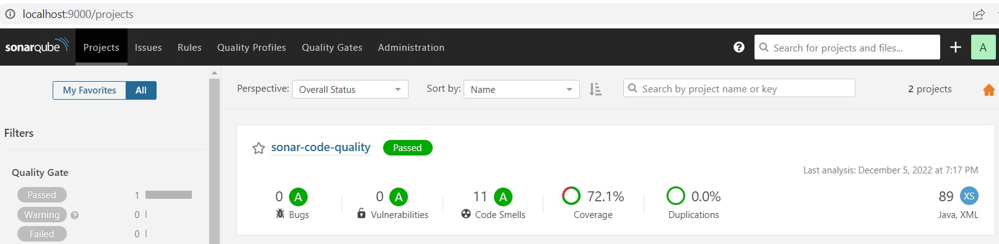
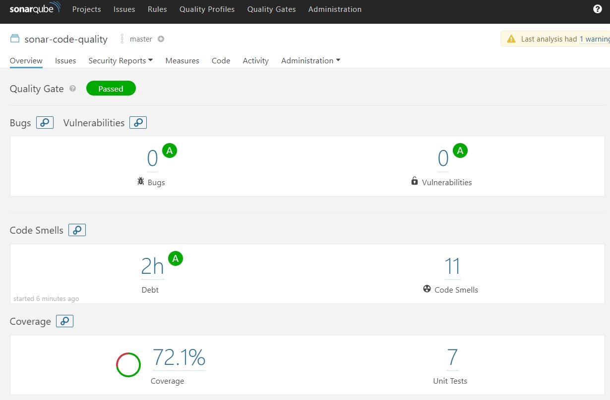

## Code Quality and coverage using SonarQube and Jacoco
Some quality metrics are useful to identify the quality of code delivered and satisfy the quality metrics which is expected from the customer.

### Setup the Sonarqube

We have to follow the below steps to configure the SonarQube in local environment
1. Download the [java11](https://adoptium.net/temurin/releases/?version=11) jdk and install the same
2. Download the [sonarqube](https://www.sonarqube.org/downloads/) community edition and extract the same in a specific folder
3. Follow these [instructions](https://docs.sonarqube.org/latest/setup/get-started-2-minutes/) to setup and run the sonarqube
4. Navigate to the sonarqube local installation folder\bin\windows-x86-64 and open in a cmd terminal then execute `StartSonar.bat` command
5. Open the browser and hit the sonarqube [url](http://localhost:9000/)

### Build and run the project

1. Checkout the project
2. Execute the `mvn clean org.jacoco:jacoco-maven-plugin:prepare-agent install` to build the project
3. Make sure the sonarqube is up and running on `http://localhost:9000` url
4. Execute the `mvn sonar:sonar` command to add the project into sonarqube

Finally, we can see the project was added like below screenshot

We can check the quality metrics like below screenshot

