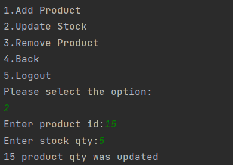

## Stationery Shop Management in Console

This project will allow you to login the user as Admin or Guest user then it will display the list of option available for the user based on user type. This project support for report generation and purchase the product from the available list.

- **SignUp:** Allow creating the new user of type admin or user
- **Login:** Allow to login the application (admin or user)
  - For Admin User
    - Inventory Management
      - **Add Product:** Add a new product into the system
      - **Update Stock:** Add more items of a specific product
      - **Remove Product:** Remove the specific product from the shop
      - **Back:** Goto the previous list of options
      - **Logout:** Logout the application and login with same or different user
    - Reports
      - **Stock Inventory Report:** This report shows current stock of available items
      - **Sales Invoice Report:** This report shows overall sales of stationery shop 
      - **Back:** Goto the previous list of options
      - **Logout:** Logout the application and login with same or different user
    - Logout
  - For Guest User
    - **Available Products:** It will display the number of available items with count
    - **Purchase:** User allow to select the product with quantity to purchase
    - **View Cart:** It will display the items added to the cart
    - **Payment:** It allows to make the payment
    - **Logout:** Logout the application and login with same or different user
- **Exit:** Exit from the application

### Screenshot Reference
Please refer the below screenshot to understand the list of option available and helps to run the application

**Signup:**
___

**Admin User Login:**
___

**Inventory Management:**
___
**Add Product:**

**Update Stock:**

**Remove Product:**

**Reports:**
___
**Stock Inventory Report:**

**Sales Invoice Report:**

**Guest User Login:**
___

**Available Products:**

**Purchase:**

**View Cart:**

**Payment:**

